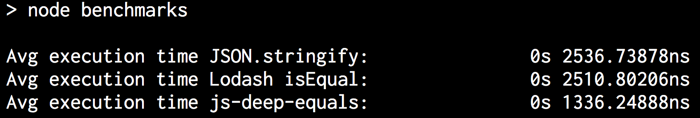

# js-deep-equals
[](https://travis-ci.org/joelwass/js-deep-equals)
[](https://coveralls.io/github/joelwass/js-deep-equals?branch=master)
[](https://www.npmjs.com/package/js-deep-equals)

testing of array and object deep equality (unsorted and sorted), accounting for nested arrays and nested objects

faster than `JSON.stringify(x) === JSON.stringify(y)` and Lodash's isEqual (benchmark code [here](test/benchmark.js))



unsorted arrays are compared by creating a [Merkle Tree](https://en.wikipedia.org/wiki/Merkle_tree) out of the input and comparing the top level hashes. hashing is done using [murmur v3](https://en.wikipedia.org/wiki/MurmurHash).

## usage

`npm install js-deep-equals`

```javascript
const { compare, compareUnsorted } = require('js-deep-equals')
const arr1 = [
  1,
  2,
  3,
  'test',
  'test2',
  'test3',
  {
    a: 12,
    b: 13,
    c: 14,
    d: [ 71, 72, 73, { 'sonested': true } ]
  }
]

// order and contents are the same as arr1
let arr2 = [
  1,
  2,
  3,
  'test',
  'test2',
  'test3',
  {
    b: 13,
    a: 12, // different order of objects is ok
    c: 14,
    d: [ 71, 72, 73, { 'sonested': true } ]
  }
]

// order of this array is different than arr1, but content is the same
let arr3 = [
  1,
  'test',
  2,
  3,
  'test2',
  {
    b: 13,
    a: 12,
    d: [ 71, 72, { 'sonested': true }, 73 ]
    c: 14,
  },
  'test3'
]

compare(arr1, arr2) // true
compare(arr1, arr3) // false
compareUnsorted(arr1, arr3) // true
```

## License
MIT
